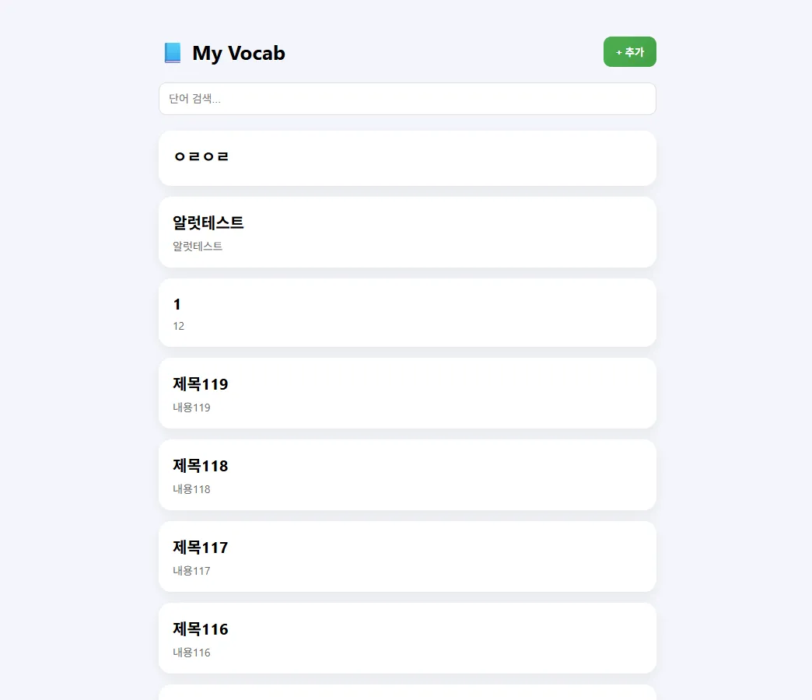
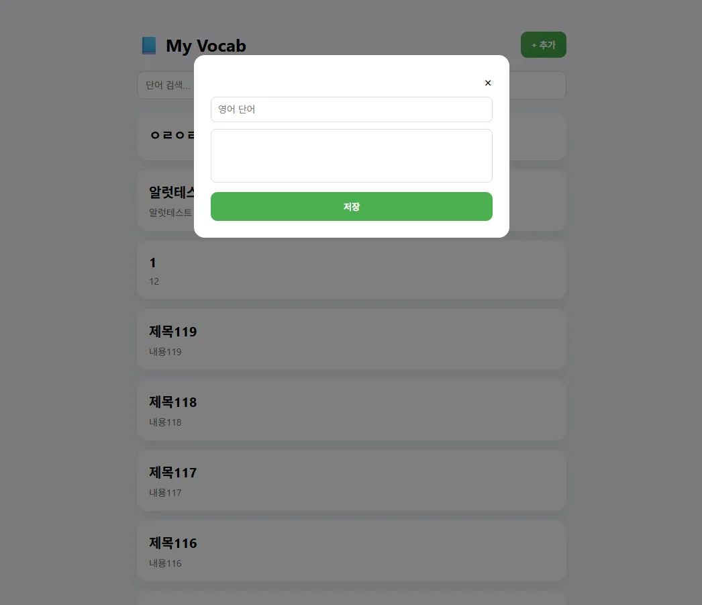
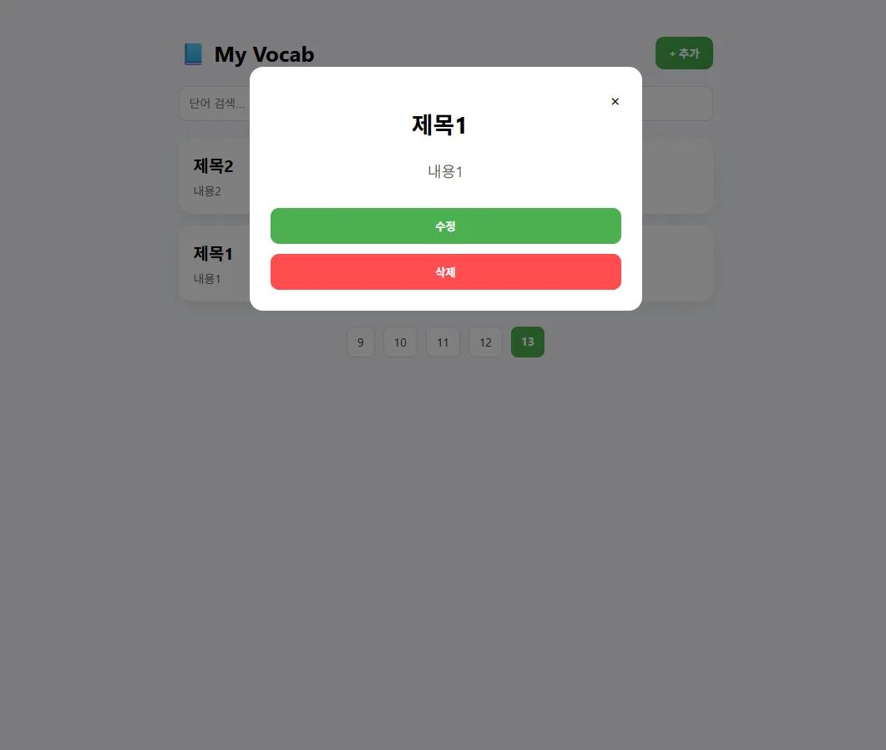
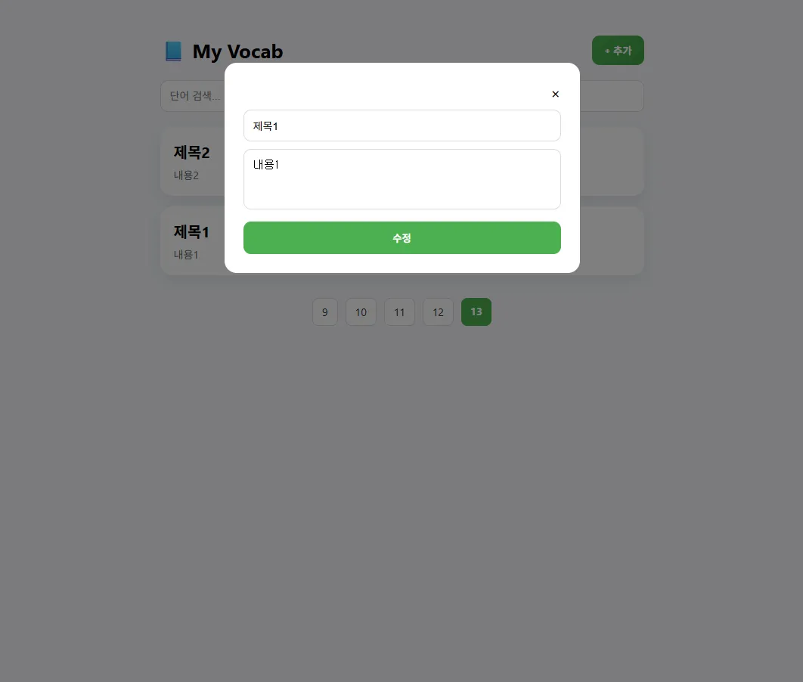
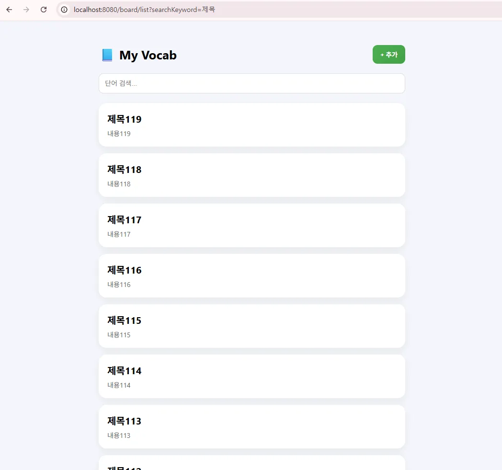

# 📘 Vocabulary Book System

영어 단어와 뜻을 관리할 수 있는 CRUD 기반 웹 애플리케이션
모달 UI와 async/await 비동기 처리를 활용한 직관적인 단어 관리 기능 제공

---

## 📷 Preview

| 목록                                          | 추가                                          | 상세                                          | 수정                                          | 검색                                          |
|---------------------------------------------|---------------------------------------------|---------------------------------------------|---------------------------------------------|---------------------------------------------|
|  |  |  |  |  |

---

# 🌐 주요 기능 (Features)

* 단어 등록 / 수정 / 삭제
* 단어 목록 조회
* 단어 상세 조회 (모달)
* 키워드 검색 기능
* 페이징 처리 (Pageable)
* async/await 기반 비동기 모달 처리

---

# ⚡ 실행 방법 (How to Run)

```bash
./gradlew bootRun
```

또는 IntelliJ에서

```
VocabBookApplication 실행
```

---

# 🛠 기술 스택 (Tech Stack)

### Back-End

* Java 17
* Spring Boot
* Spring Data JPA
* Hibernate

### Front-End

* Thymeleaf
* HTML5 / CSS3
* JavaScript (async/await)

### Database

* MySQL

---

# 📂 프로젝트 구조 (Project Structure)

```
vocab-book
│
├── src
│   ├── main
│   │   ├── java/com/example/vocab_book
│   │   │   ├── controller
│   │   │   │   └── BoardController.java
│   │   │   ├── service
│   │   │   │   └── BoardService.java
│   │   │   ├── repository
│   │   │   │   └── BoardRepository.java
│   │   │   ├── entity
│   │   │   │   └── Board.java
│   │   │   └── VocabBookApplication.java
│   │   │
│   │   └── resources
│   │       ├── templates
│   │       │   ├── sample
│   │       │   │   ├── boardList.html
│   │       │   │   ├── boardWrite.html
│   │       │   │   ├── boardView.html
│   │       │   │   ├── boardModify.html
│   │       │   ├── boardList.html
│   │       │   ├── boardWriteModal.html
│   │       │   ├── boardViewModal.html
│   │       │   ├── boardModifyModal.html
│   │       │   └── message.html
│   │       ├── static
│   │       └── application.properties
│
└── build / gradle 설정 파일
```

---

# 🏗 시스템 아키텍처 (Architecture)

```
브라우저
   ↓
Controller (요청 처리)
   ↓
Service (비즈니스 로직)
   ↓
Repository (JPA)
   ↓
Database (MySQL)
```

---

# 🔄 데이터 흐름 (Flow)

1️⃣ 사용자 이벤트 (클릭, 입력)

2️⃣ async/await 기반 요청 처리

3️⃣ Controller에서 요청 수신

4️⃣ Service에서 로직 처리

5️⃣ Repository → DB 조회

6️⃣ 결과를 HTML로 반환

---

# 📌 핵심 기능 설명

## ✔ 1. 단어 등록

* 모달에서 입력
* async/await로 요청 처리
* 저장 후 메시지 출력

---

## ✔ 2. 단어 조회

* 카드 형태 UI
* 클릭 시 모달로 상세 조회

---

## ✔ 3. 단어 수정

* 기존 데이터 로딩 후 수정
* DB 업데이트 처리

---

## ✔ 4. 단어 삭제

* 버튼 클릭 시 삭제
* 리스트로 리다이렉트

---

## ✔ 5. 검색 기능

```
/board/list?searchKeyword=apple
```

* 제목 기준 부분 검색

---

## ✔ 6. 페이징 처리

```java
int nowPage = pageable.getPageNumber() + 1;
int startPage = Math.max(nowPage - 4, 1);
int endPage = Math.min(nowPage + 5, totalPages);
```

---

## ✔ 7. async/await 비동기 처리

```javascript
async function openModal(url) {
    try {
        const res = await fetch(url);
        const html = await res.text();

        document.getElementById("modal-body").innerHTML = html;
        document.getElementById("modal").style.display = "block";

    } catch (error) {
        console.error(error);
    }
}
```

---

# ⚠️ 트러블 슈팅 (Issues & Fixes)

### 1. DB 컬럼 오류

* 문제: content 컬럼 없음
* 해결: 테이블 재생성

---

### 2. Thymeleaf sequence 오류

* 문제: 변수 null
* 해결: startPage / endPage 정확히 전달

---

### 3. 수정 기능 미동작

* 문제: save() 누락
* 해결: boardService.write() 추가

---

### 4. 모달 로딩 실패

* 문제: URL 매핑 불일치
* 해결: PathVariable 방식 통일

---

# 📚 배운 점 (Learned)

* MVC 구조 이해
* JPA 데이터 처리 방식
* Thymeleaf 동적 렌더링
* async/await 비동기 흐름 이해
* 페이징 처리 로직

---

# 🚀 개선 방향 (Future Improvements)

* 로그인 기능 추가
* 사용자별 데이터 관리
* UI/UX 개선
* REST API 구조 확장
* 즐겨찾기 기능 추가
